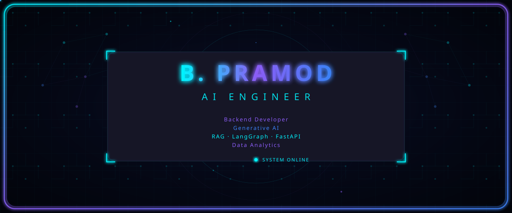
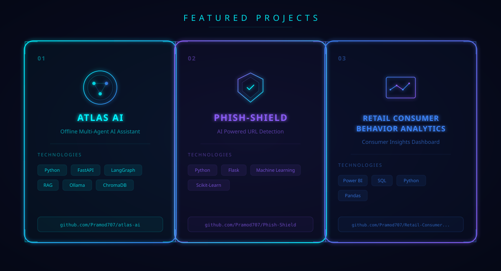

<!-- HERO SECTION -->

  

<!-- DIVIDER -->

  

<!-- TERMINAL SECTION -->

  

<!-- DIVIDER -->

  

<!-- AI DASHBOARD -->

  

<!-- DIVIDER -->

  

<!-- NEURAL NETWORK -->

  

<!-- DIVIDER -->

  

<!-- SKILLS MATRIX -->

  

<!-- DIVIDER -->

  

<!-- PROJECTS -->

  

<!-- DIVIDER -->

  

<!-- GITHUB STATS -->

## 

 

 

  

<!-- DIVIDER -->

  

<!-- SNAKE ANIMATION -->

  

<!-- DIVIDER -->

  

<!-- PARTICLES -->

  

<!-- CONTACT & FOOTER -->

 

<!-- PROFILE VIEWS -->

